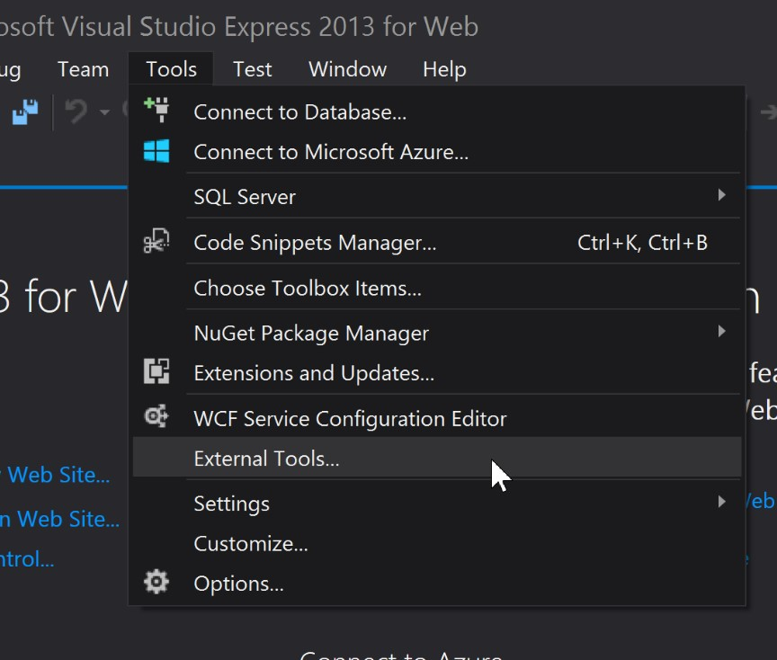
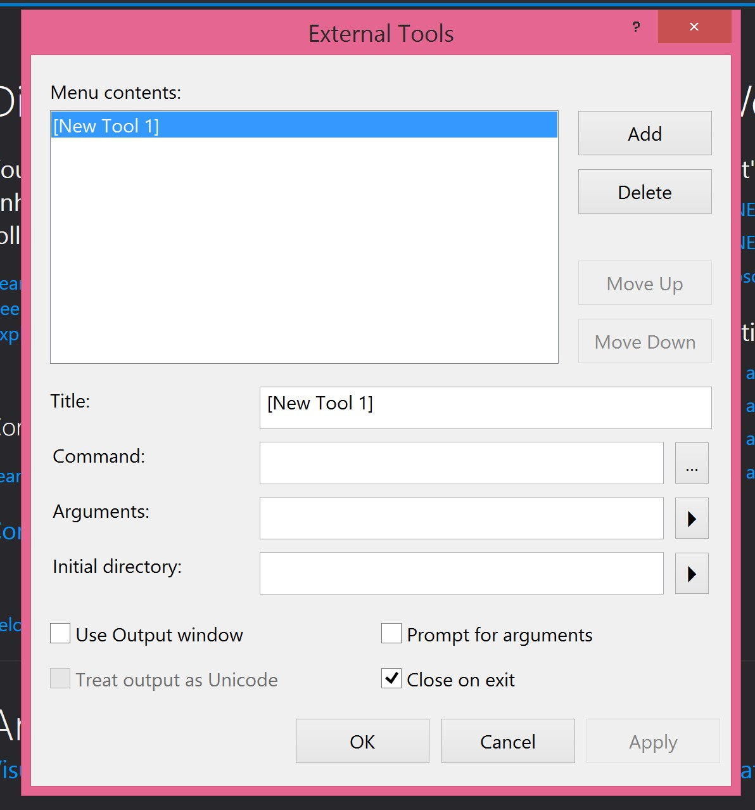
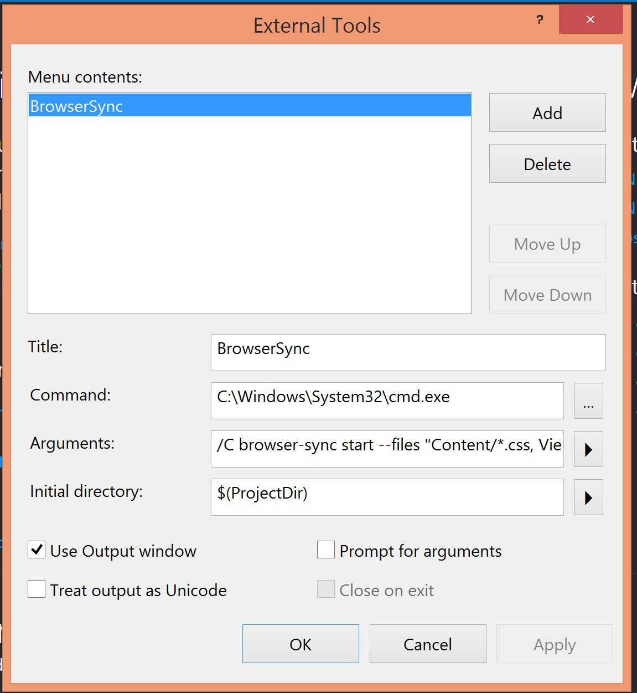
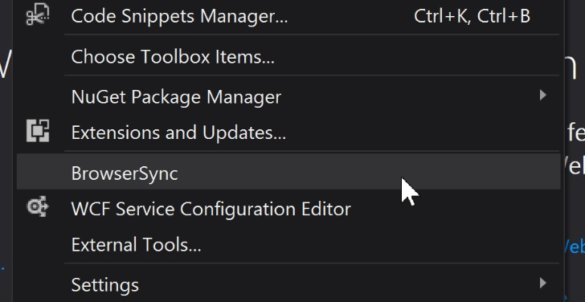
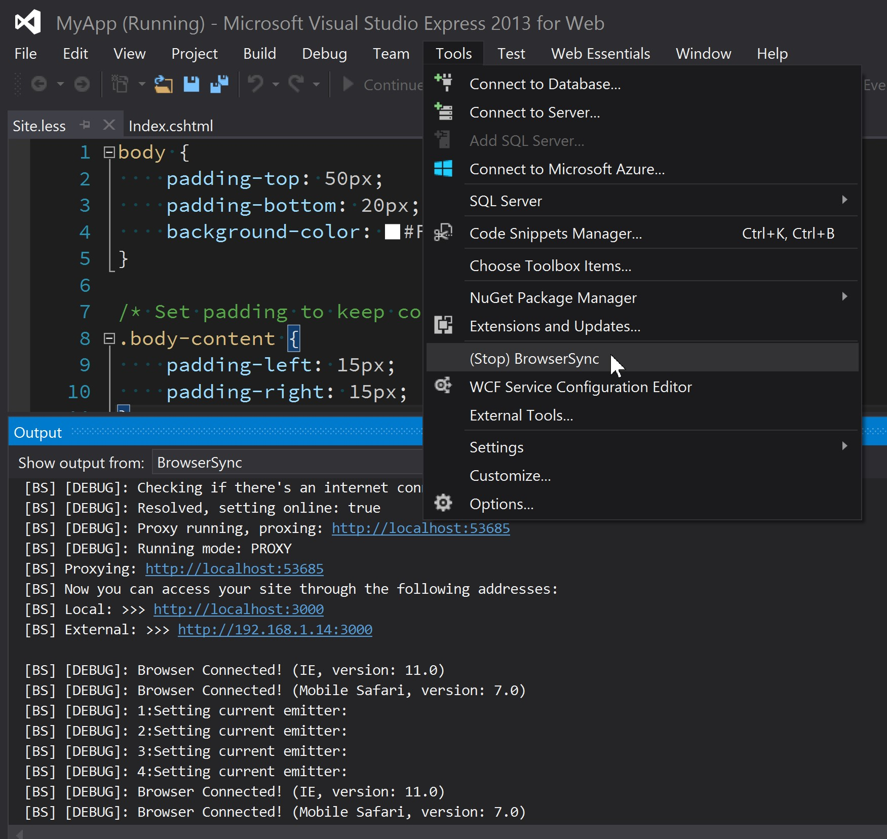

# Using BrowserSync as a tool in Visual Studio

 

The BrowserSync tool by **Shane Osbourne** is extremely useful and I simply couldn't give up trying to make it work flawlessly within @VisualStudio (I've used it on Mac OS X already).

> When you’re making responsive websites, there’s a lot of tweaking and testing to do. BrowserSync makes your workflow faster by synchronising URLs, interactions and code changes across multiple devices. It’s wicked-fast and totally free.  
[http://www.browsersync.io/](http://www.browsersync.io/)

### Prerequisites

1) [EASY] Install `Node.js` using native installer:

[Node.js downloads page](http://nodejs.org/download/)

2) [EASY] Install BrowserSync via Node.js `npm`:

```bash
npm install -g browser-sync
```


For more: [BrowserSync installation page](http://www.browsersync.io/#install)

## Add and use BrowserSync in Visual Studio

#### Step 1. Add BrowserSync as external tool [IMMEDIATE]

Start your Visual Studio and open tools menu and then external tools manager panel:





Now define a new tool using BrowserSync excellent [Command Line Interface](http://www.browsersync.io/docs/command-line/). Use following values as starting point for your own settings:

```
Title:  BrowserSync
```
```
Command:  C:\Windows\System32\cmd.exe
```

```
Arguments:  /C browser-sync start --files "Content/*.css, Views/*.cshtml" --proxy localhost:53685 --logLevel debug
```

```
Initial directory: $(ProjectDir)
```

Now make sure that `Use Output Window` option is checked:

[x] Use Output Window



After making sure that everything is correctly filled choose apply to add this new tool to Visual Studio.

The `Title` describes how your new tool will be visible under Visual Studio menu:



We will be running BrowserSync via Windows system CMD tool:
```
Command: C:\Windows\System32\cmd.exe
```

starting at the current project (e.g. my web-site mvc project) folder:

```
Initial directory: $(ProjectDir)
```

passing BrowserSync related information as comamnd line arguments to `cmd.exe` tool:

```
Arguments:  /C browser-sync start --files "Content/*.css, Views/*.cshtml" --proxy localhost:53685 --logLevel debug
```

Here I've specified that BrowserSync should watch for changes in `Content` and `Views` directories in files usually used in C# .NET MVC development. You should modify it to fit your .NET project design.

What we have done here is basically the same as opening Windows CMD console directly, navigating to project root directory and invoking BrowserSync directly:
```
browser-sync start --files "Content/*.css, Views/*.cshtml" --proxy localhost:53685 --logLevel debug
```

Note that you need to make sure that your values for `--proxy` are correct - above are just samples taken from my project settings.

### Step 2. Running BrowserSync with your MVC project [EASY]

Open your MVC project (or solution) in Visual Studio editor. Hit `F5` to start/debug project in browser. Once project is started open previously defined `BrowserSync` tool. If you have set up everything correctly you should see a new browser window popping up and within Visual Studio BrowserSync output with useful information to one of Visual Studio windows:


